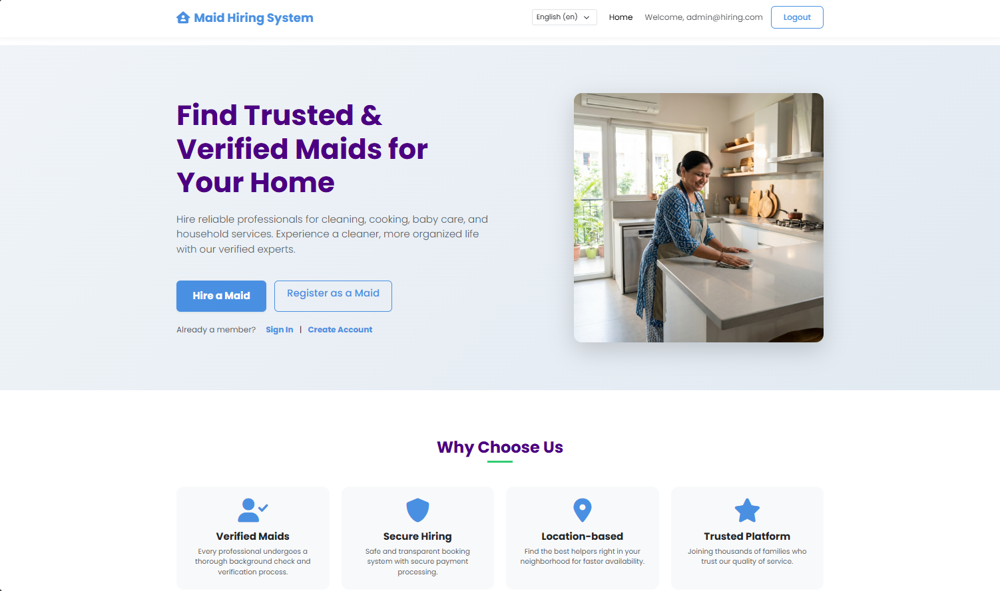
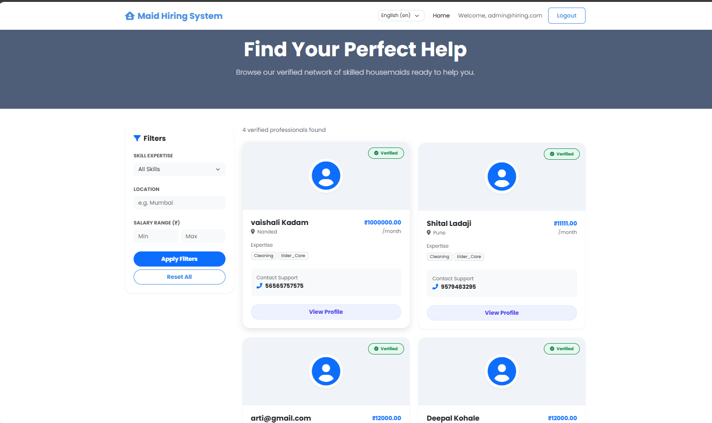
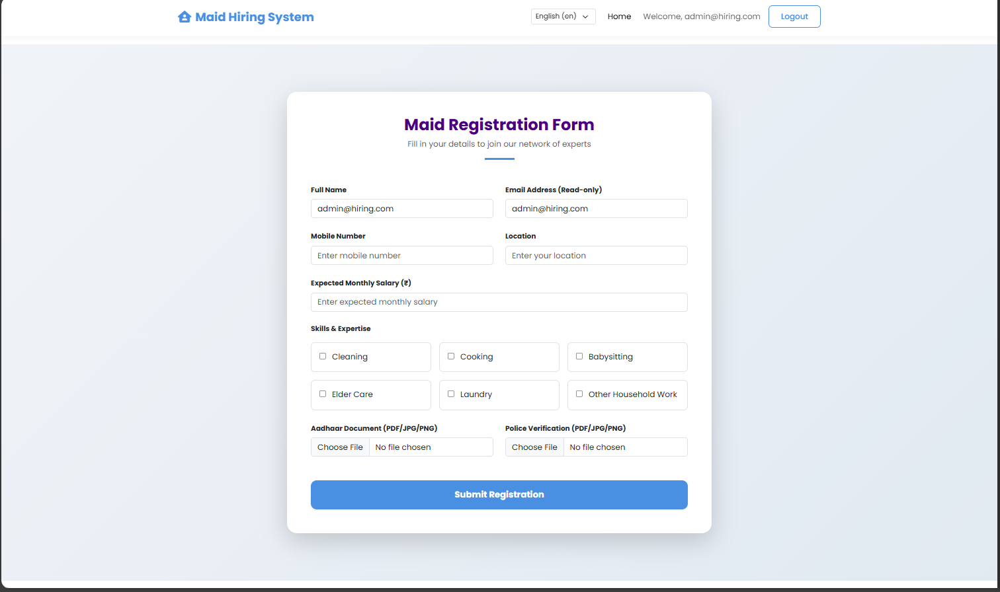
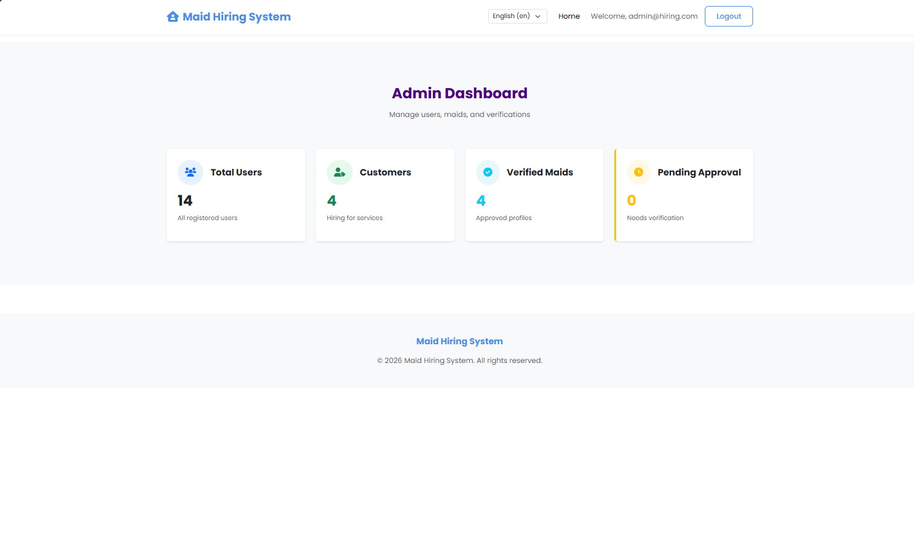
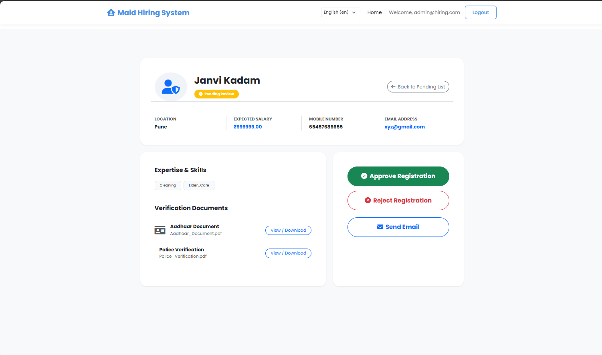
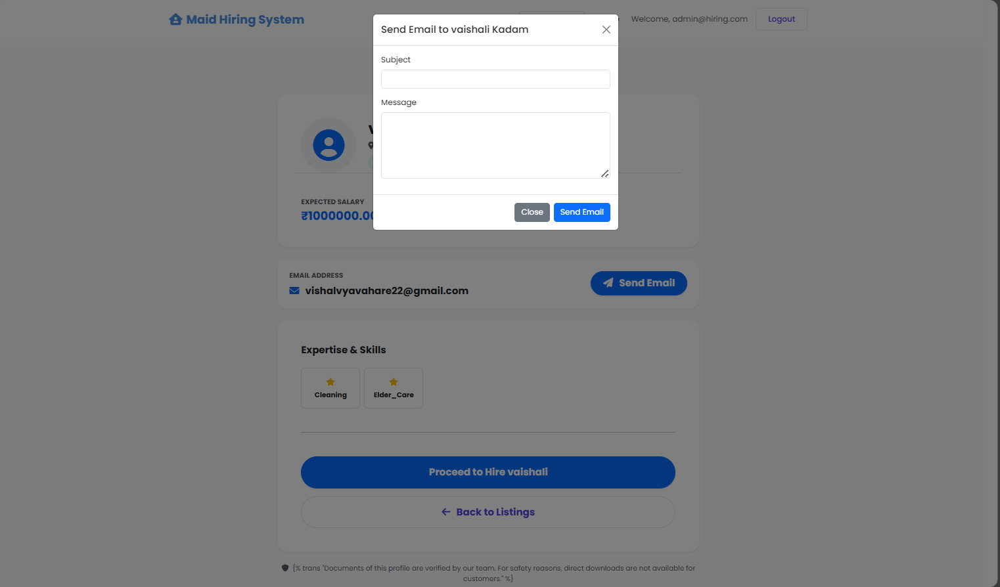

# 🏠 Maid Hiring System

A full-stack web application developed using Django that allows users to hire verified maids easily and efficiently.

---

## 🚀 Features

- Maid Registration System
- Customer Registration & Login
- Admin Dashboard
- Maid Profile Management
- Multi-language Support (English, Hindi, Marathi)
- Email Notification System
- Secure Authentication

---

## 🛠 Tech Stack

- Frontend: HTML, CSS
- Backend: Python
- Framework: Django
- Database: SQLite
- Version Control: Git & GitHub

---

## ⚙️ Installation

1. Clone the repository:
git clone https://github.com/Vaishnavi-Vyavahare/Maid_Hiring_System.git

2. Navigate to project folder:

cd Maid_Hiring_System
3. Install dependencies:

pip install django
4. Run the server:

python manage.py runserver

---

---

# 📸 Project Screenshots

## 🏠 Home Page

---

## 👩‍🔧 Maid Listing Page

---

## 📝 Registration Page

---

## 🛠 Admin Dashboard

---

## ✅ Maid Verification

---

## 💬 Message / Contact Feature

---

## 👩‍💻 Developed By

Vaishnavi Vyavahare  
MCA Student | Python & Django Developer
